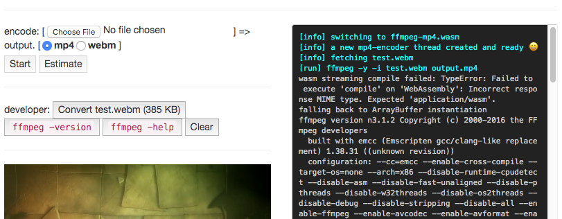

<div align="center">
  <h1><code>async-thread-worker</code></h1>
  <p>
    <strong>An <code>async/await</code> abstraction for <a href="https://developer.mozilla.org/en-US/docs/Web/API/Worker">Web Workers</a></strong>
  </p>
</div>

[![npm][npm-badge]][npm-url]
[![MIT licensed][mit-badge]][mit-url]
[![CI][actions-badge]][actions-url]

[npm-badge]: https://img.shields.io/npm/v/async-thread-worker.svg
[npm-url]: https://www.npmjs.com/package/async-thread-worker
[mit-badge]: https://img.shields.io/badge/license-MIT-blue.svg
[mit-url]: https://github.com/w3reality/async-thread-worker/blob/master/LICENSE
[actions-badge]: https://github.com/w3reality/async-thread-worker/workflows/CI/badge.svg
[actions-url]: https://github.com/w3reality/async-thread-worker/actions

## About

`async-thread-worker` presents an abstraction of Web Worker thread communication based on the client-server model. Supported features are:

- `await`ing thread operations,
- integration of basic Web Worker APIs (e.g. transferables, the `terminate()` method etc.), and
- class methods/interfaces for implementing client-server style functionality.

After introducing some basic examples for quickly getting started, we demonstrate applications using Wasm binaries (C code compiled by [Emscripten](https://github.com/emscripten-core/emscripten) and Rust code by [`wasm-pack`](https://github.com/rustwasm/wasm-pack)) embedded inside worker threads.

For other libraries that realize similar functionality, you might also consider:

- [GoogleChromeLabs/comlink](https://github.com/GoogleChromeLabs/comlink)
- [developit/greenlet](https://github.com/developit/greenlet)
- [developit/workerize](https://github.com/developit/workerize)
- [josdejong/workerpool](https://github.com/josdejong/workerpool)

## Getting Started

### Installation

```
$ npm install async-thread-worker
```

### <a name="usage"></a>Usage

Here's a basic example of implementing a worker (abstracted as `thread`) and interacting with it.
Use [`sendRequest()`](#sendRequest) and [`sendResponse()`](#sendResponse) for client-server style communications.
[ [demo](https://w3reality.github.io/async-thread-worker/examples/simple/index.html) | [source](https://github.com/w3reality/async-thread-worker/tree/master/examples/simple) ]

[*index.html*](https://github.com/w3reality/async-thread-worker/blob/master/examples/simple/index.html): Synchronously sending requests to a worker.
```js
// <script src='async-thread-worker.min.js'></script>

const thread = new AsyncThreadWorker.Thread('my-thread-worker.js');

for (let payload of ['a', 'b', 'c', 'd']) {
    const response = await thread.sendRequest(payload);
    console.log('[main] got response:', response);
}
```

[*my-thread-worker.js*](https://github.com/w3reality/async-thread-worker/blob/master/examples/simple/my-thread-worker.js): Implementation of the worker.  Use the provided `id` to respond to a request.
```js
importScripts('async-thread-worker.min.js');

class MyThreadWorker extends AsyncThreadWorker.ThreadWorker {
    onRequest(id, payload) { // impl
        console.log('[worker] got request with:', payload);
        this.sendResponse(id, payload.toUpperCase());
    }
}
const myThreadWorker = new MyThreadWorker(self);
```

The results in the developer console:
```
[worker] got request: a
[main] got response: A
[worker] got request: b
[main] got response: B
[worker] got request: c
[main] got response: C
[worker] got request: d
[main] got response: D
```

## Examples

- **simple** - Basic client-server communications with a worker. [ [live](https://w3reality.github.io/async-thread-worker/examples/simple/index.html) | [source](https://github.com/w3reality/async-thread-worker/tree/master/examples/simple) | [howto](#usage) ]
- **tasks** - Delegating various tasks to a worker (calculator).  This example also demonstrates error handling with `try/catch` and the [`sendError()`](#sendError) API. [ [live](https://w3reality.github.io/async-thread-worker/examples/tasks/index.html) | [source](https://github.com/w3reality/async-thread-worker/tree/master/examples/tasks) ]
- **serial-vs-parallel** - Running multiple workers serially/parallelly. [ [live](https://w3reality.github.io/async-thread-worker/examples/serial-vs-parallel/index.html) | [source](https://github.com/w3reality/async-thread-worker/tree/master/examples/serial-vs-parallel) ]
- **terminate** - `terminate()` api example. [ [live](https://w3reality.github.io/async-thread-worker/examples/terminate/index.html) | [source](https://github.com/w3reality/async-thread-worker/tree/master/examples/terminate) ]
- **transferables** - Transfering an [`ArrayBuffer`](https://developer.mozilla.org/en-US/docs/Web/JavaScript/Reference/Global_Objects/ArrayBuffer) object back and forth for efficient drawing.  The [`sendRequest()`](#sendRequest) and [`sendResponse()`](#sendResponse) APIs support [transferable objects](https://developers.google.com/web/updates/2011/12/Transferable-Objects-Lightning-Fast). [ [live](https://w3reality.github.io/async-thread-worker/examples/transferables/index.html) | [source](https://github.com/w3reality/async-thread-worker/tree/master/examples/transferables) ]
- **class-sharing** - Passing a JavaScript class to a worker. [ [live](https://w3reality.github.io/async-thread-worker/examples/class-sharing/index.html) | [source](https://github.com/w3reality/async-thread-worker/tree/master/examples/class-sharing) ]
- **wasm-ffmpeg** - webm/mp4 encoder app inspired by ["Running FFMPEG with WASM in a Web Worker"](https://paul.kinlan.me/running-ffmpeg-with-wasm-in-a-web-worker/).  In this app, we use `async-thread-worker` instead of [Comlink](https://github.com/GoogleChromeLabs/comlink) in order to control encoder threads in more client-server oriented style. [ [live](https://w3reality.github.io/async-thread-worker/examples/wasm-ffmpeg/index.html) | [source](https://github.com/w3reality/async-thread-worker/tree/master/examples/wasm-ffmpeg) ]
[](https://w3reality.github.io/async-thread-worker/examples/wasm-ffmpeg/index.html)
- **rust-fern-bench** - WebVR app for benchmarking fractal computation with Rust+wasm vs JavaScript. [ [live](https://w3reality.github.io/threelet/examples/rust-fern-bench/index.html) | [source](https://github.com/w3reality/threelet/tree/master/examples/rust-fern-bench) ] 🔗

## API

### `AsyncThreadWorker.Thread`
The `Thread` class is for abstraction of the main thread's side (*client*).

- **`constructor(path)`**
Creates a `Thread` object that is a worker's interface.  The underlying Web Worker object wrapped by `Thread` is also created based on its implementation specified by `path`.
    - `path` **string** The path to a worker's implementation.

- <a name="sendRequest"></a>**`sendRequest(payload=undefined, transferables=[])`**
Sends a request to the worker (*server*) with data `payload`.  [Transferable objects](https://developer.mozilla.org/en-US/docs/Web/API/Transferable) can be specified in the optional `transferbles` array so that they are efficiently sent to the other thread without [structured clone](https://developer.mozilla.org/en-US/docs/Web/API/Web_Workers_API/Structured_clone_algorithm).
Returns a promise corresponding to the server's action ([`sendResponse()`](#sendResponse) or [`sendError()`](#sendError)).
    - `payload` **object | primitive** e.g. `42`, or `{name: 'foo', input: buf}`, where `buf` is an `ArrayBuffer`.
    - `transferables` **Array\<object\>** e.g. `[buf,]`

- **`getWorker()`**
Returns the raw Web Worker object wrapped by `Thread` (or `null` if the worker is already terminated).

- **`terminate()`**
Immediately terminates the worker (internally using [`Worker.terminate()`](https://developer.mozilla.org/en-US/docs/Web/API/Worker/terminate)).

### `AsyncThreadWorker.ThreadWorker`
The `ThreadWorker` class is for abstraction of the worker's side (*server*).

- **`constructor(self, opts={})`**
Creates a `ThreadWorker` object that represents the worker thread by wrapping
 the bare Web Worker object (`self`).
    - `self` [**DedicatedWorkerGlobalScope**](https://developer.mozilla.org/en-US/docs/Web/API/DedicatedWorkerGlobalScope) The Web Worker object to be wrapped.
    - `opts` **object** Optional data that can be passed to [`onCreate(opts)`](#onCreate).

- <a name="onRequest"></a>**`onRequest(id, payload)`**
Called when the worker thread (*server*) received a request with data `payload` from the main thread (*client*).  Implement this method to respond to the client by either [`sendResponse()`](#sendResponse) or [`sendError()`](#sendError).
    - `id` **string** An auto-generated request id to be required by [`sendResponse()`](#sendResponse) or [`sendError()`](#sendError).
    - `payload` **object | primitive**

- <a name="sendResponse"></a>**`sendResponse(id, payload=undefined, transferables=[])`**
Sends a response to the main thread (*client*) with data `payload`.  [Transferable objects](https://developer.mozilla.org/en-US/docs/Web/API/Transferable) can be specified in the optional `transferbles` array so that they are efficiently sent to the other thread without [structured clone](https://developer.mozilla.org/en-US/docs/Web/API/Web_Workers_API/Structured_clone_algorithm).
    - `id` **string** A request id provided by [`onRequest()`](#onRequest).
    - `payload` **object | primitive** e.g. `42`, or `{name: 'foo', output: buf}`, where `buf` is an `ArrayBuffer`.
    - `transferables` **Array\<object\>** e.g. `[buf,]`

- <a name="sendError"></a>**`sendError(id, error)`**
Sends an error response to the main thread (*client*) with data `error`.
    - `id` **string** A request id provided by [`onRequest()`](#onRequest).
    - `error` **object | primitive**

- <a name="onCreate"></a>**`onCreate(opts)`**
Called when the `ThreadWorker` is created.  One may override this method when extending the `ThreadWorker` class.
    - `opts` **object** Optional parameters given to `constructor()`.

## Build

```
$ npm install  # set up build tools
$ npm run build
```
